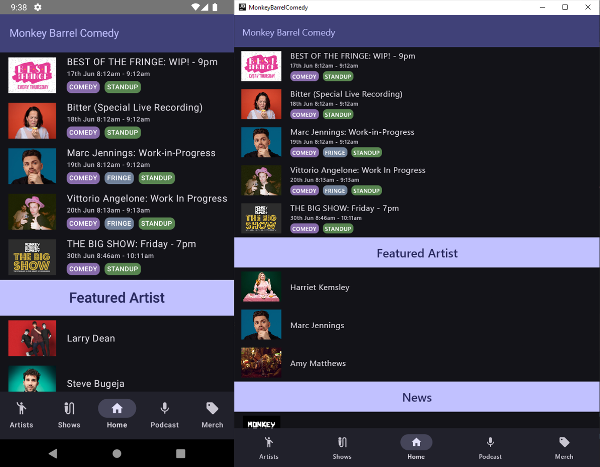
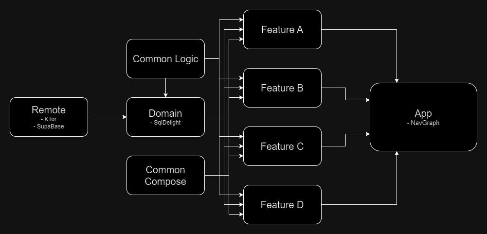

# Monkey Barrel Comedy app
Monkey Barrel Comedy app (**Android**, **iOS** and **Desktop**) using Kotlin Multiplatform and Jetpack Compose.

This is a Kotlin Multiplatform project targeting Android, iOS and Desktop, where the aim to have ***all*** code in common without the need for platform specific code written. I know, it's a big ask.

Learn more about [Kotlin Multiplatform](https://www.jetbrains.com/help/kotlin-multiplatform-dev/get-started.html)…

## Screenshot

## Dependencies

> We all stand on the shoulders of giants

Without the incredible work of thousands and thousands of people nothing here would be possible. Below is listed the many dependencies used in this project, with an explanation of why and how. Please feel free to make suggestions, or better yet PRs, for improvements.

### **[Compose](https://www.jetbrains.com/lp/compose-multiplatform/)**
No further introduction or explanation should be required for *why* Compose has been used, but an explanation on *how* might be useful.
Because of the excellent integration between Compose and **ViewModels** (Natively supported or otherwise), Compose has been used for all UI related features, from screen construction to standalone **Composable** elements reused throughout the code. This also includes Compose enabled **Navigation**.

### **[Material Designs](https://m3.material.io/)**
Design is difficult on any platform, let alone across multiple platforms.
Material Designs has been used because it provides platform consistent, well designed, best-in-class design UI components, that work as expected out-of-the-box, while also providing the most amount of flexibility and customization.
In addition to the UI components, the tools and environment around Material Designs are comprehensive and well integrated with existing tools. Everything from complete [Figma UI elements](https://www.figma.com/community/file/1035203688168086460) available for use in any Figma project, to [Material Icons](https://m3.material.io/styles/icons/applying-icons) and [extraordinary integration](https://m3.material.io/develop/android/jetpack-compose) with Compose, makes Material Designs the only real cross-platform choice at the moment.
[Material Designs - Why](https://m2.material.io/design/platform-guidance/cross-platform-adaptation.html)

### **[Koin](https://insert-koin.io/docs/reference/koin-mp/kmp/)**
Koin is used for Dependency Injection through the project, with an emphasis on decoupling code and using module internal *implementations*, while making *interfaces* publicly available. This is and will continue to be especially useful for testing purposes.

### **[Ktor](https://ktor.io/)**
Network is limited to the **REMOTE** module only (except for Coil, which is used for image loading). This is done so that all networking logic can be contain within a single module, enforcing the need for the different modules to only communicate using deliberately chosen app specific logic, instead of any external networking requirements.

### **[SQLDelight](https://github.com/cashapp/sqldelight)**
Following the best practice:
> Save data to a local DB and let UI react to observations of the locally stored Data

SQLDelight is used not only as the SQL storage, but also to provided a lot of additional function such as defining **stored data models** and **data querying** logic.
As SQL functionality is specific to each platform, SQLDelight provides cross platform functionality, while also using platform specific SQL drivers.

### **[SupaBase](https://supabase.com/)**
While the functionality provided by Firebase is difficult to replace, SupaBase has made a great effort in providing replacements for some of the most popular features. Firebase does not provide easy or complete Kotlin Multiplatform support, while SupaBase does provide KMP support via it's community library [Supabase-kt](https://github.com/supabase-community/supabase-kt).

Supabase is currently used in the **REMOTE** module for read access to the SupaBase database, with future plans for integration with image storage and user authentication.

### **[Compose Webview Multiplatform](https://github.com/KevinnZou/compose-webview-multiplatform)**
No client application would be complete without the ability to access the web, for which Compose Webview Multiplatform is used.
This library uses client specific webview implementations, including for JVM/Desktop which is not the easiest task to achieve. While there are some features missing from the library, such as downloading files, it works well with Compose and is easy to setup and use for the mobile apps, and requiring a few more lines of code for JVM/Desktop.

### **[Coil](https://coil-kt.github.io/coil/)**
Image loading is provided by Coil which is a Kotlin-first library with great integration with KMP.

### *For Testing*
Testing is a bit of a struggle at the moment on KMP, but very much doable.
One issue is that [MockK](https://mockk.io/), used extensively for mocking in Android and Kotlin work, does not offer KMP support at the moment, and is therefor not used in this project.
Additionally, UI testing functionality is not provided in any meaningful or stable way.

### **[Kotest](https://kotest.io/)**
> Kotest is a flexible and elegant **multi-platform** test framework for **Kotlin** with extensive **assertions** and integrated **property testing**

### **[Turbine](https://github.com/cashapp/turbine)**
> Turbine is a small testing library for kotlinx.coroutines [`Flow`](https://kotlin.github.io/kotlinx.coroutines/kotlinx-coroutines-core/kotlinx.coroutines.flow/-flow/).

## Feature Separation
Feature, and module, separation is always a hot topic. Without getting into any discussion on how best to separate and untangle code, this codebase separates features into *mostly* self-contained modules that only relay on commonly shared modules such as **logging, common, compose and domain**.
The goal here is to be able to quickly add new features, not entangle features together and also be able to remove features. Note that feature modules *do not* handle their own network and relaying solely on the **DOMAIN** module for data from any source (DB, remote, manually constructed, etc).

### Layers Architecture - [Modules.md](docs/MODULES.md)

## Navigation
Navigation is always a complicated and difficult aspect of any application, and while some opinionated choices have been made here, nothing is set in stone and improvements can and should be made when beneficial.
The navigation of the applications uses [Compose Navigation](https://www.jetbrains.com/help/kotlin-multiplatform-dev/compose-navigation-routing.html), with [JetNews](https://github.com/android/compose-samples/tree/main/JetNews) being a good simplified example. This does however work well across platforms and allows simple Compose NavHost integration.

The **App** module, containing the only platform specific code for each targeted platforms entry point into the app, contains the navigation logic as it is the only module that directly depends on each **feature** module. This allows each feature to take in *lambdas* using only primitive data, such as ints, longs or strings, enabling navigation between features that know nothing about each other and are not dependent on each other. This is one of the main benefits of the way navigation is setup in the current code.

## Future Improvements

- Introduce UI testing of all Compose code.
- Added automated unit/UI testing via build pipelines that support KMP.
- Added users and user auth via SupaBase.

## Known Issues

- There is currently an issue with SQLDelight and the construction of a single table. An 'in-memory' DB is currently being used until the issue has been resolved. [Bug Report](https://github.com/cashapp/sqldelight/issues/5291)
- iOS app is currently under development, and might not work correctly. Please feel free to contribute to a functioning iOS app.

## How to contribute 
- Take the code and do new things with it.
- Start a Discussion (instead of very open ended issue).
- Provide improvements via PRs that improve *small or smaller* aspects of the project, rather than changing "everything".
- Suggest changes or improvements or even other libraries that *add* functionality without compromising on existing functionality.
